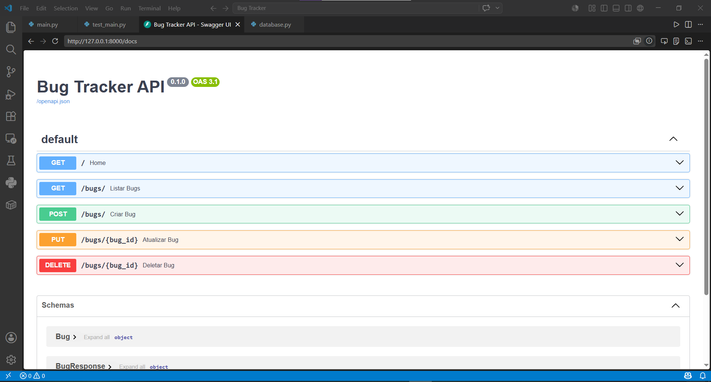
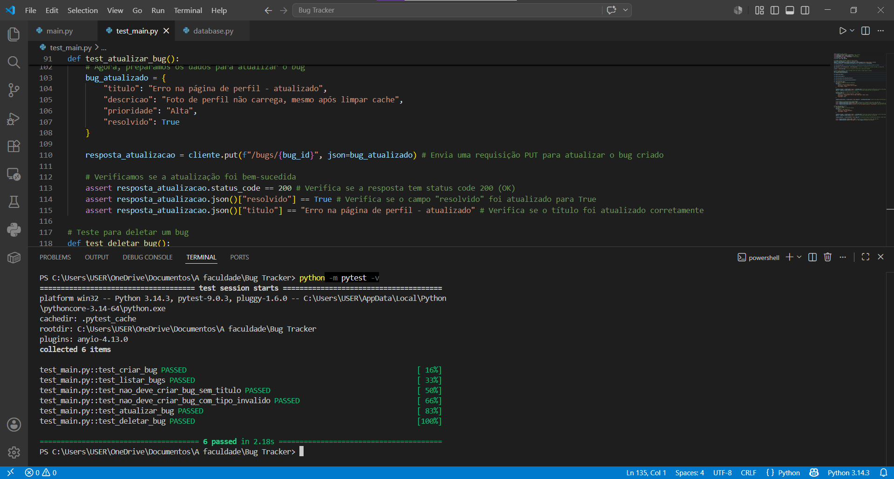

# 🐞 Bug Tracker API - Automação e Qualidade de Software


> Uma API RESTful construída com foco na validação de contratos de dados e automação de testes isolados.

## 📸 Demonstração do Projeto

*(Interface de documentação interativa gerada automaticamente pelo Swagger UI)*


## 🎯 Sobre o Projeto
Este projeto é uma API RESTful para gerenciamento de falhas e bugs de software (Bug Tracker). Foi desenvolvido com o objetivo principal de servir como um ambiente robusto para a aplicação de práticas avançadas de **Quality Assurance (QA) e Automação de Testes Back-end**.

Ao invés de focar apenas no desenvolvimento do CRUD, a arquitetura foi desenhada para facilitar a injeção de dependências, garantindo contratos estritos de dados e testes completamente isolados do ambiente de produção.

## 🛠️ Stack Tecnológica
* **FastAPI:** Framework backend principal.
* **Pydantic:** Validação rigorosa de *payloads* (contrato de API).
* **SQLAlchemy (ORM) + SQLite:** Persistência de dados.
* **Pytest & HTTPX:** Motor de automação de testes e simulação de requisições.

---

## 🧪 Estratégia de Qualidade (QA)

A suíte de testes (`test_main.py`) foi construída com foco em confiabilidade e isolamento.

### 1. Isolamento de Ambiente (Setup & Teardown)
Para evitar que os testes automatizados insiram "lixo" no banco de dados principal (`bugs.db`), o projeto utiliza o recurso de **Dependency Overrides** do FastAPI. 
* Durante a execução do Pytest, o banco de dados real é interceptado e substituído por um banco temporário (`testes_qa.db`).
* Uma *Fixture* automática é responsável por criar as tabelas antes de cada sessão de teste e **destruir o banco de dados** ao final, garantindo que todo teste comece em um estado limpo e previsível.

### 2. Cenários Validados (Test Matrix)

*(Execução da suíte de testes automatizados com 100% de aprovação)*


A cobertura de testes contempla fluxos positivos e negativos para garantir a resiliência da API:

#### Cenários de Sucesso (Happy Paths - Status 200)
- ✅ `test_criar_bug`: Valida a criação de um recurso e a persistência do ID gerado pelo banco.
- ✅ `test_listar_bugs`: Garante o retorno correto de uma lista (vazia ou populada) através do método GET.
- ✅ `test_atualizar_bug`: Verifica a alteração de status (ex: `resolvido=True`) utilizando o método PUT.
- ✅ `test_deletar_bug`: Confirma a exclusão de um registro existente pelo ID via DELETE.

#### Cenários de Exceção (Sad Paths / Testes Negativos - Status 422)
- ❌ `test_nao_deve_criar_bug_sem_titulo`: Valida se a API bloqueia requisições sem campos obrigatórios, conferindo se a localização do erro (`loc`) aponta corretamente para "titulo" (`type: missing`).
- ❌ `test_nao_deve_criar_bug_com_tipo_invalido`: Testa a tipagem forte do sistema enviando uma `string` para um campo `boolean`, garantindo que o sistema não processe dados fora do contrato.

---

## 🚀 Como Executar o Projeto Localmente

### 1. Instalação e Preparação
Clone o repositório e instale as dependências necessárias:
  ```bash
  pip install fastapi uvicorn sqlalchemy pytest httpx
```

### 2. Rodando a Aplicação (Modo Desenvolvedor)
Para iniciar o servidor localmente com persistência no arquivo bugs.db:
  ```bash
  python -m uvicorn main:app --reload
```
Acesse a documentação interativa (Swagger) gerada automaticamente em: http://127.0.0.1:8000/docs

### 3. Executando a Suíte de Automação (Modo QA)
Para rodar os testes automatizados e verificar a integridade da API:
  ```bash
  python -m pytest -v
```
---
##### Desenvolvido por Carlos Felipe, como parte do portfólio de Qualidade de Software.
